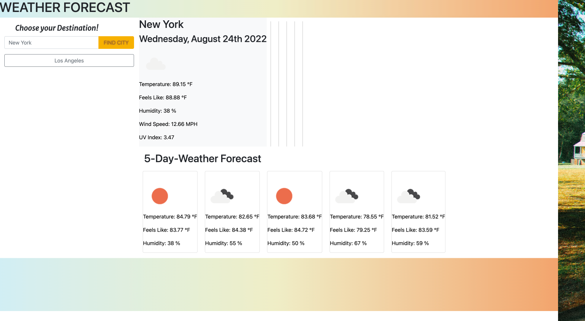
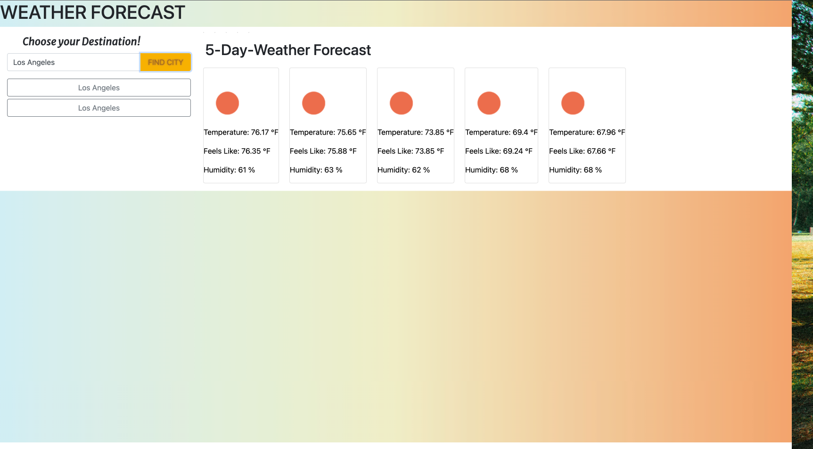

# API Weather Dashboard
[](https://github.com/Chasek6/api-weather-dashboard)
## Description
The application is a 5-day forecast of the weather for whatever city of the user decides to pick. The Weather Dashboard will present you with current & future conditions for the city and will add previous searched cities to a user city search-list. I decided on giving the webpage a tropical color scheme to give users the feeling of vacation while scoping out possible weather for a trip.  URL Link here --> https://chasek6.github.io/Weather-Dashboard/


# ScreenShots





## Table of Contents 
- [API Weather Dashboard](#api-weather-dashboard)
  - [Description](#description)
- [ScreenShots](#screenshots)
  - [Table of Contents](#table-of-contents)
  - [Installation](#installation)
  - [Usage](#usage)
  - [License](#license)
  - [Contributing](#contributing)
  - [Tests](#tests)
  - [Questions](#questions)
## Installation
To install necessary dependencies, run the following command:
```
---
```
## Usage
The application uses HTML,CSS,JAVASCRIPT,BOOTSTRAP Framework and Jquery.
## License
This project is licensed under the MIT license.
  
## Contributing
Chase Stratton : Nice to meet You^-^!
## Tests
To run tests, run the following command:
```
---
```
## Questions
If you have any questions about the repo, open an issue or contact [Chasek6](undefined) directly at quranstratton@gmail.com.
